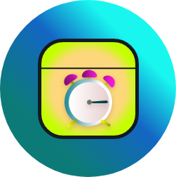

<!--
*** Thanks for checking out this README Template. If you have a suggestion that would
*** make this better, create a pull request or simply open
*** an issue with the tag "enhancement".
*** Thanks again! Now go create something AMAZING! :D
-->


<!-- PROJECT SHIELDS -->
<!--
*** I'm using markdown "reference style" links for readability.
*** Reference links are enclosed in brackets [ ] instead of parentheses ( ).
*** See the bottom of this document for the declaration of the reference variables
*** for contributors-url, forks-url, etc. This is an optional, concise syntax you may use.
*** https://www.markdownguide.org/basic-syntax/#reference-style-links
-->
[![LinkedIn][linkedin-shield]][linkedin-url]


<!-- PROJECT LOGO -->
<br />
<p align="center">
  <a href="https://github.com/DRISHTANT-DUBEY/Beacon/">
    
  </a>

  <h3 align="center">Beacon Todo App</h3>

  <p align="center">
    An Amazing Introductory Flutter Project is Been Made For everyone as a KickStart to Flutter !
    <br />
    <a href="https://github.com/DRISHTANT-DUBEY/Beacon"><strong>Explore Code »</strong></a>
    <br />
    <br />
    <a href="https://github.com/DRISHTANT-DUBEY/Beacon">View Screen Piece</a>
    ·
    <a href="https://github.com/DRISHTANT-DUBEY/Beacon/issues">Report Bug</a>
    ·
    <a href="https://github.com/DRISHTANT-DUBEY/Beacon/issues">Request Feature</a>
  </p>
</p>


<!-- TABLE OF CONTENTS -->
## Table of Contents

* [About the Project](#about-the-project)
  * [Built With](#built-with)
* [Getting Started](#getting-started)
  * [Installation](#installation)
* [Usage](#usage)
* [Roadmap](#roadmap)
* [Contact](#contact)


<!-- ABOUT THE PROJECT -->
## About The Project

There are many great flutter templates available on GitHub, however, I didn't find one that really suit my needs so I created this enhanced one. I want to create a Flutter App so basic that it'll be the last one you ever need.

Here's why:
* Your time should be focused on creating something amazing. A project that solves a problem of api construction and login for user auth. 
* You shouldn't be doing the same tasks over and over like creating the logic from scratch
* You should element DRY principles to the rest of your life :smile:

Of course, no one app will serve all projects since your needs may be different. So I'll be adding more in the near future. You may also suggest changes by forking this repo and creating a pull request or opening an issue.


### Built With
This section lists the major frameworks that we built for using project.
* [Flutter](https://flutter.dev)
* [Python](https://www.python.org)
* [Flask](https://flask.palletsprojects.com/en/1.1.x/)


<!-- GETTING STARTED -->
## Getting Started

This is an example of how you may give instructions on setting up your project locally.
To get a local copy up and running follow these simple example steps.

### Installation

1. Clone the repo
```sh
git clone https://github.com/DRISHTANT-DUBEY/Beacon.git
```
2. Install Flutter with its packages
```sh
git clone https://github.com/flutter/flutter.git -b stable
```
3. Create a virtual env in `restAPI` in desired backend directory
```sh
virtualenv -your_env_name
```
4. You can create `flutter_app` in desired app directory
```sh
flutter create app_name
```


<!-- USAGE EXAMPLES -->
## Usage

The top bar Swipable Desired Screen features with witness of time value ideas with some need point catch inspiration could be a mindset builder for your future app constructions in and with different tech enviorments.

<!-- ROADMAP -->
## Roadmap

See the [open issues](https://github.com/DRISHTANT-DUBEY/Beacon/issues) for a list of proposed features (and known issues).
The roadmap starts with intializing the repos. to git and tracking your project.
1. Go for Flutter installation
2. Have a emulator iOS or mobile with android studio.
3. Go for virtual enviorment creation and doing:
```python
 pip install requirements.txt
```
4. Go for Data Base role creation and Validation with api_key in code
5. Migrate Data , Upgrade Data, Request Data From UI front . 


<!-- CONTRIBUTING -->
## Suggestions

Suggestions are what make project such an amazing one to be learn, inspire, and create. Any suggestions you make are **greatly appreciated**.

1. Go to the wanted Repos.
2. Publish or Post your own issue
3. We Commit Changes to your issue
5. Can Clone the project to swing with the code and its features.


<!-- CONTACT -->
## Contact

Project Link: [https://github.com/DRISHTANT-DUBEY/Beacon://github.com/DRISHTANT-DUBEY/Beacon)]

<!-- MARKDOWN LINKS & IMAGES -->
<!-- https://www.markdownguide.org/basic-syntax/#reference-style-links -->
[linkedin-shield]: https://img.shields.io/badge/-LinkedIn-black.svg?style=plastic&logo=linkedin&colorB=555
[linkedin-url]: https://www.linkedin.com/in/drishtant-dubey-631249189
